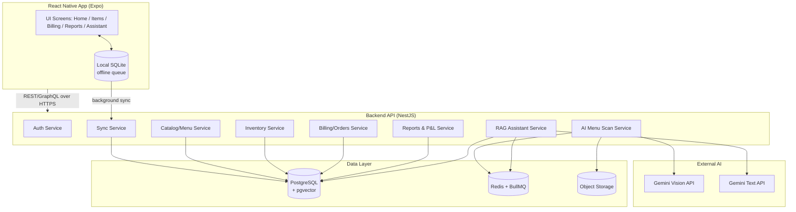
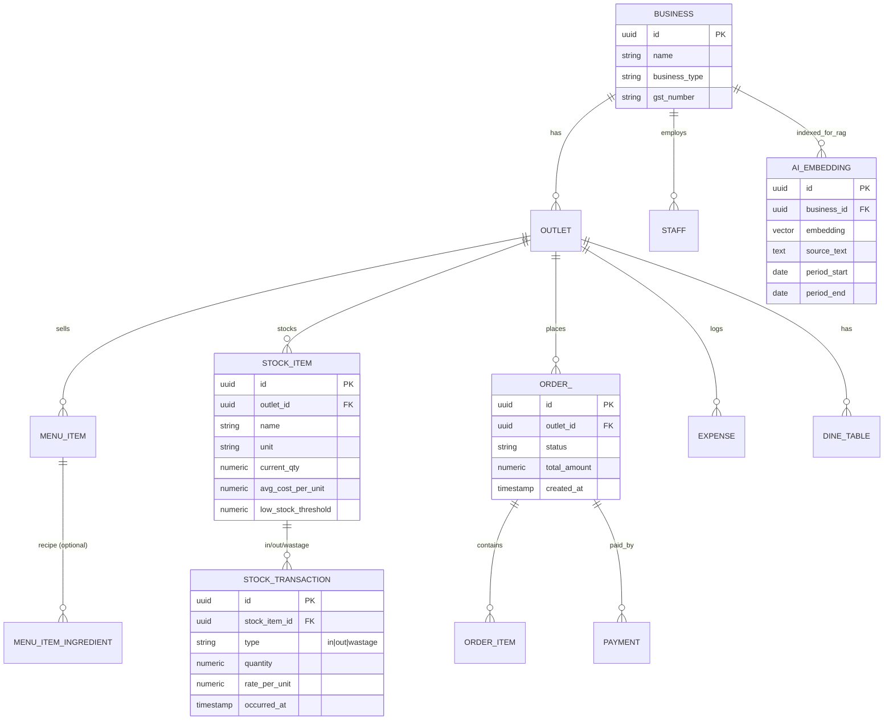

# Architecture

## 1. Tech Stack

| Layer | Choice | Why |
|---|---|---|
| Mobile app | React Native + Expo (Expo Router) | Matches your existing stack; fast iteration, OTA updates |
| Local/offline store | WatermelonDB or SQLite (expo-sqlite) | Offline-first billing; sync queue to server |
| State/data layer | React Query + Zustand | Server-state caching + simple local UI state |
| Backend API | Node.js + NestJS (or Express if you want lighter) | Structured, modular, good for multi-tenant SaaS |
| Database | PostgreSQL | Relational integrity for money/stock; supports `pgvector` |
| Vector store (RAG) | `pgvector` extension on the same Postgres | Avoids a separate vector DB for v1; simpler ops |
| Cache/queue | Redis + BullMQ | Background jobs: AI menu scan processing, report generation, sync |
| File storage | S3-compatible bucket (menu photos, item images, bills) | Cheap, standard |
| AI — Menu Scan | Gemini Vision (multimodal) | OCR + structured extraction from menu photos |
| AI — Business Assistant | Gemini (text) + RAG over Postgres data | Grounded answers from the owner's real data |
| Auth | JWT (access + refresh) + OTP via SMS provider | Standard mobile auth pattern |
| Printing | Bluetooth/ESC-POS thermal printer SDK | KOT & bill printing |
| Infra | Docker containers → any cloud (AWS/GCP/Render/Railway) | Portable |

## 2. High-Level Architecture

## 3. Mobile App Architecture
- **Expo Router** — file-based routing, tab navigation matching the reference app: Home, Items, `+` (quick add), Reports, More/Assistant.
- **Offline-first billing**: orders/bills are written to local SQLite immediately (optimistic), queued, then synced to backend when online. Conflict resolution: server is source of truth for stock quantities; client billing actions replay in order.
- **Modules toggle by business type**: `businessType: 'restaurant' | 'cafe' | 'retail'` drives which screens/components render (e.g., Table selection only for restaurant/cafe; barcode scan emphasized for retail).
- **AI Assistant screen**: simple chat UI, calls `/assistant/query`, streams response.

## 4. Backend Services (domain-driven modules)
1. **Auth & Tenant** — signup/login, OTP, JWT issuance, `business_id` (tenant) attached to every request via middleware.
2. **Catalog** — categories, items, variants, recipe/BOM (item → raw material mapping, optional).
3. **Inventory** — stock items, stock transactions (in/out/wastage), valuation, low-stock alerts.
4. **Billing/Orders** — order lifecycle, KOT generation, payments, table management (restaurant), cart (retail).
5. **Reports & P&L** — aggregation queries/materialized views for sales, top items, P&L computation (see §6).
6. **AI Menu Scan** — accepts photo → uploads to S3 → calls Gemini Vision with a structured-extraction prompt → returns draft items → owner reviews/edits → bulk insert into Catalog.
7. **RAG Assistant** — see §5.
8. **Sync** — reconciles offline mobile writes with server state.

## 5. RAG Assistant Design
1. **Indexing (continuous, background job)**: whenever sales/stock/expense data changes, generate/update small text "facts" (e.g., daily sales summary, item performance, expense entries) and embed them with a text-embedding model, storing vectors in `pgvector` tagged with `business_id` and date.
2. **Query time**:
   - Owner asks a question in the app.
   - Query is embedded, similarity-searched **within that business's own vectors only** (hard filter on `business_id` — never cross-tenant).
   - For clearly structured questions ("profit this month"), the service *also* runs a direct SQL aggregation (via the P&L engine) rather than relying purely on retrieved text — more accurate for numbers.
   - Retrieved context + computed numbers are passed to Gemini with a prompt instructing it to answer only from the provided data and cite the date range.
3. **Guardrails**: assistant is scoped to read-only queries over the owner's own data; never executes writes; always states the period the numbers cover.

## 6. Profit & Loss Engine
- **Revenue** = SUM(order totals) for period, by outlet.
- **COGS** = SUM(quantity sold × recipe cost) if recipes configured, else SUM(stock consumed at purchase cost) for the period.
- **Gross Profit** = Revenue − COGS.
- **Operating Expenses** = SUM(manually logged expenses) for the period.
- **Net Profit** = Gross Profit − Operating Expenses.
- Exposed as a reusable internal service so both the **Reports UI** and the **RAG Assistant** call the same calculation (single source of truth — the AI never "estimates" P&L independently).

## 7. Core Data Model (key tables)

## 8. Security & Multi-tenancy
- Every table carries `business_id`/`outlet_id`; every query is scoped by the authenticated tenant (enforced at the ORM/repository layer, not just app logic).
- RBAC middleware checks staff role before allowing sensitive actions (discounts, stock edits, viewing reports).
- Audit log table for stock adjustments and price overrides.

## 9. Deployment
- Mobile: Expo EAS Build → Play Store / App Store, OTA updates for JS-only changes.
- Backend: Dockerized NestJS app + Postgres (with pgvector) + Redis, deployed on a managed platform (Railway/Render/AWS ECS); CI/CD via GitHub Actions.
