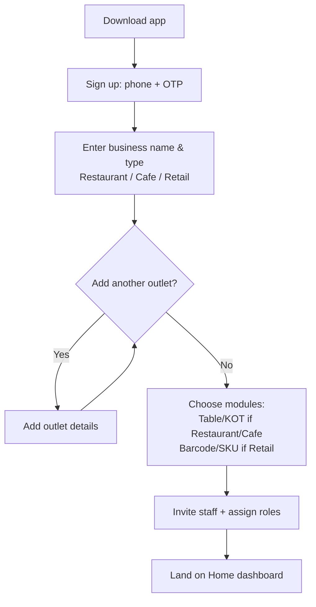
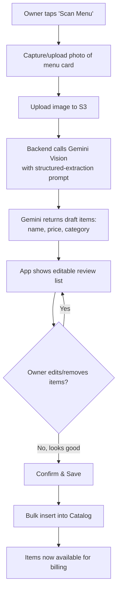
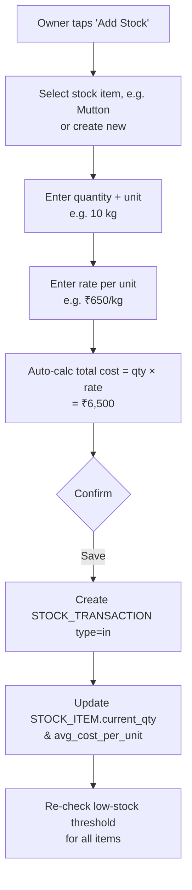
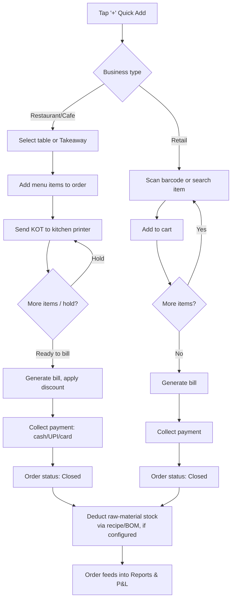
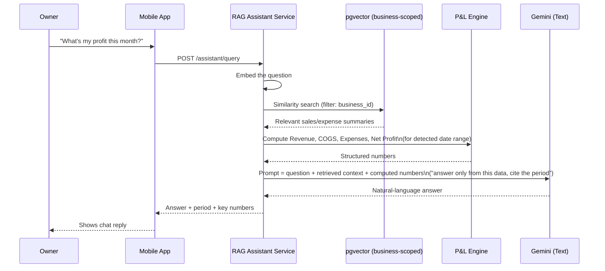
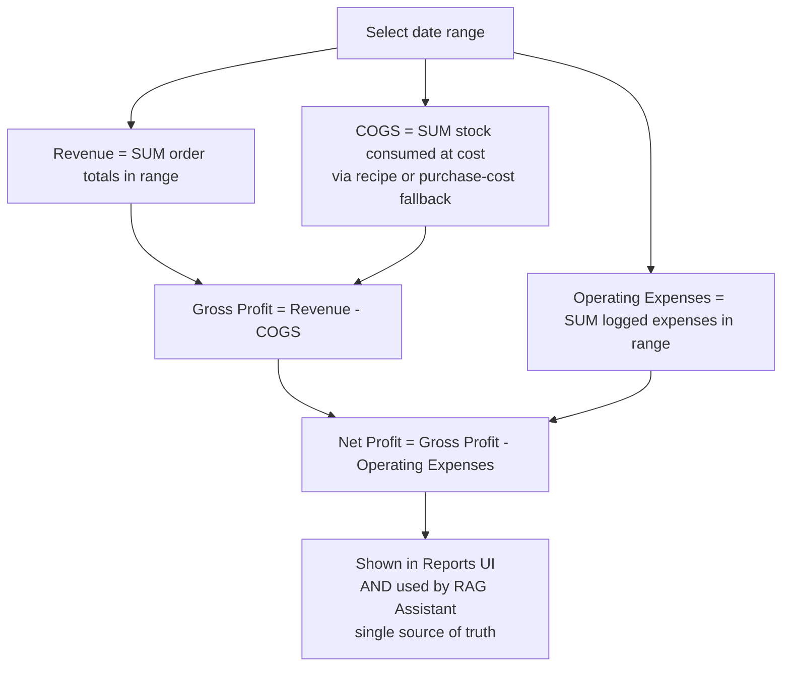

# Flow Diagrams

## 1. Onboarding & Business Setup

## 2. AI Menu Scan Flow

## 3. Manual Stock Entry Flow

## 4. Billing Flow (Restaurant/Cafe vs Retail)

## 5. RAG Business Assistant Flow

## 6. Profit & Loss Calculation Flow

